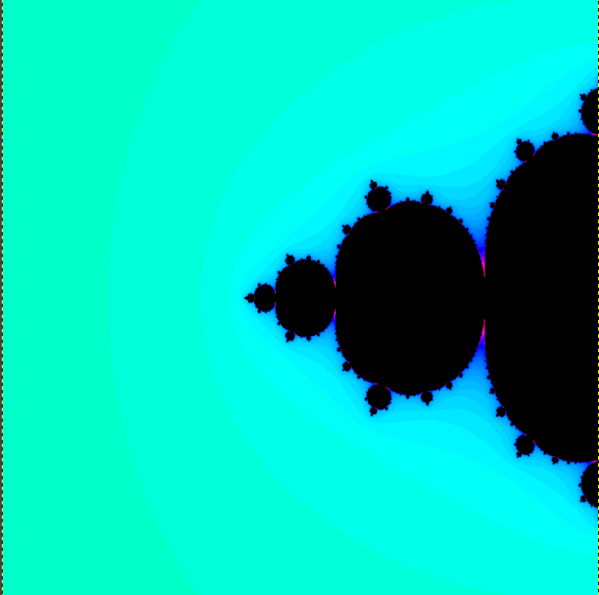
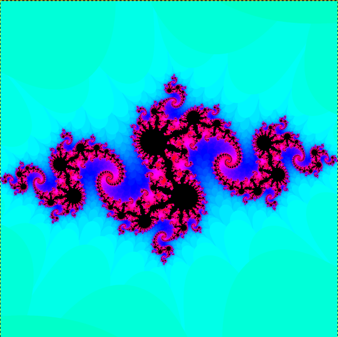
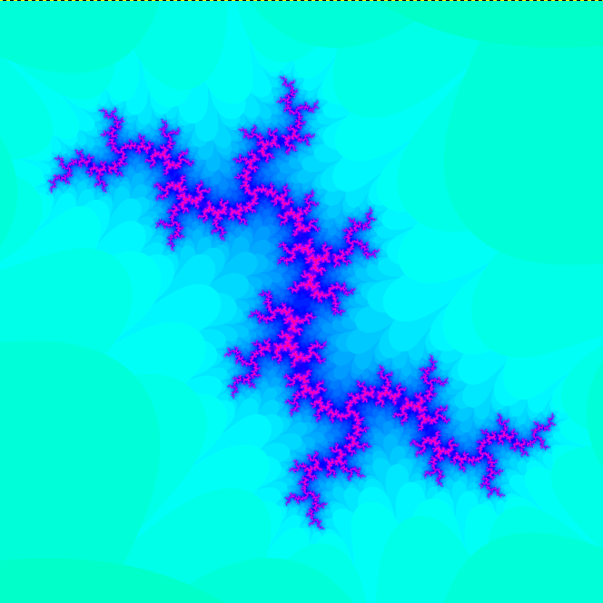
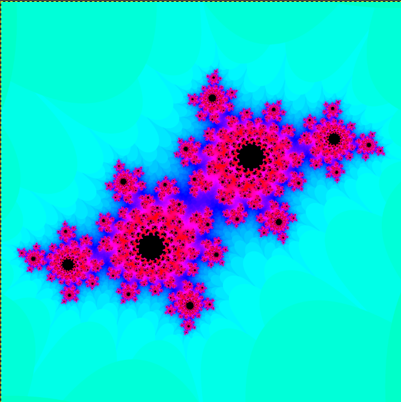
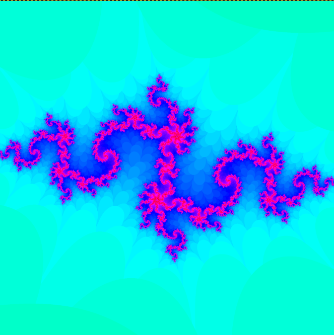

# Fractal Generation Using Haskell

## About
Exploring fractal generation with a functional programming based language i.e Haskell. The project demonstrates functional programming principles and offers a visually stunning introduction to fractal geometry in the form of the Mandelbrot & Julia set.

## Building the project

To build the project you will need the GHC compiler and all you need to do is run the build script. Once the build is complete the executable can be found in the project folder as Main.exe.

## Requirements

The output of the project will require you to open bitmap pixel image files under the images folder. So any software like GIMP that can open this file format will work.

## Outputs

Output for the mandelbrot Set

Output for Julia Set V1

Output for Julia Set V2

Output for Julia Set V3

Output for Julia Set V4

